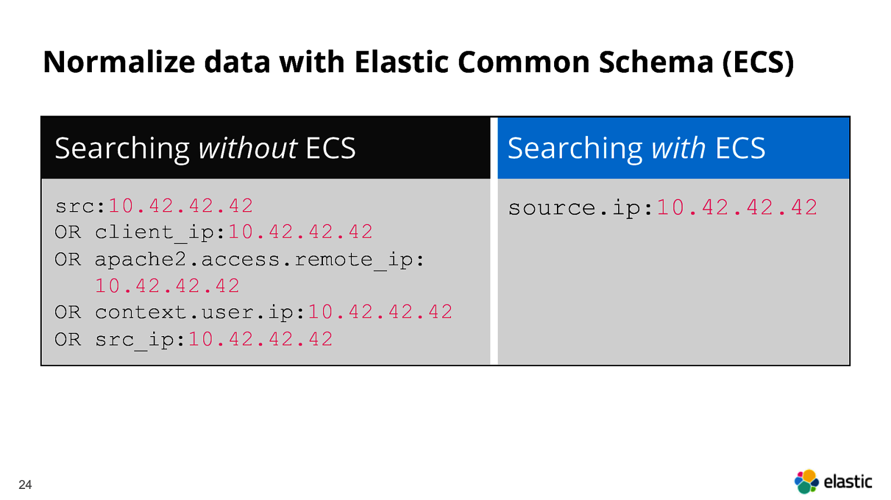

In DFIR or as a SOC analyst you search across many logs. Each source names the same thing differently and that wastes time. **Elastic Common Schema (ECS) gives one set of fields so one query runs across Sysmon, EDR, firewall, WAF and web server logs. Less field fixing, faster correlation, more time on the facts.**

ECS is Elastic’s schema, but you can use it as a neutral normalization target across your logging pipeline. One set of field names with the same meaning across sources. Saved searches and detections work everywhere you mapped. Pivots are predictable. Timelines align accurately. Instead of maintaining separate filters for src, src_ip and client_ip, you use source.ip, which removes ambiguity and improves triage efficiency.

# why it matters
Correlation becomes more precise. With consistent user, host and IP fields and predictable timestamps, you can align events, follow an entity across datasets, identify gaps and determine the blast radius by user and host without rewriting filters. Normalize all timestamps to UTC and rely on @timestamp for event order to avoid misaligned timelines.

Rules and workflows remain stable. Saved searches, detections and automations continue to function when data sources or pipelines change. Playbooks reference the same fields across all sources, which makes handoffs smoother and reduces maintenance overhead.

Consider a common case. You identify suspicious command execution and need to determine its scope. Without ECS, you must create separate filters for process fields in EDR and Sysmon, and different IP fields in WAF and access logs. With ECS, you filter once on process.name, process.command_line, source.ip and destination.ip, then apply it to all mapped sources.

# what to map first
Map the fields that drive most pivots and scoping first. Use user.* for identity, process.* for execution, host.* for machine context, url.* and http.* for web activity, and source.ip plus destination.ip for network edges. With these in place your core queries and detections usually run across EDR, Sysmon, WAF and web logs without edits. Extend with file.* and registry.* when you need Windows persistence, and cloud.account.* and cloud.instance.* as you add cloud telemetry.

ECS will not map every source completely and some fields will remain empty. It still provides significant value. Expand as you integrate additional log sources.

The reason to adopt ECS is straightforward. You reduce query maintenance, improve consistency and focus more time on determining what happened, the extent of the impact and the required response.

---

### References

-  [What is ECS? - Elastic Documentation](https://www.elastic.co/guide/en/ecs/current/ecs-reference.html#_what_is_ecs)  
  A concise introduction to the goals and purpose of ECS from the Elastic team.

-  [ECS Field Reference](https://www.elastic.co/guide/en/ecs/current/ecs-field-reference.html)  
  Full list of ECS fields and data types, organized by categories.

