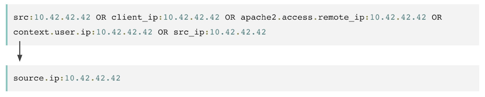

DFIR/Detection engineers work needs searches across many logs/artifacts from many sources. Each source names the same concept differently, which slows triage and analysis. ECS defines one field set across sources so one query runs everywhere. Less field fixing, faster links, and more time spent on facts.

ECS defines shared field names you can map every source to. Map all inputs to shared names, keep semantics stable across products. Saved searches and detections remain valid when pipelines or vendors change. Timelines align cleanly when every event uses UTC and a single timestamp. Keep the original offset in event.timezone if auditors need it. Stop juggling src, src_ip, and client_ip, use source.ip and destination.ip.  
When proxies exist, parse headers and fill client.ip with the real origin.

---

# why it matters

Consistent user, host, process, and IP fields make pivots direct and repeatable. Events line up across sources, so scoping and blast radius checks run faster. Content stays stable when inputs change, since rules reference the same names. Analysts avoid custom filters for each product and keep focus on behavior. One case shows the effect: suspicious command runs, you need scope fast. With ECS, filter on process.name and process.command_line across EDR and Sysmon. Add source.ip and destination.ip, reuse the same query in WAF and access logs.

# what to map first

Start with fields that drive pivots and scoping, not every detail today. Identity uses user.name, user.domain, and user.id, keep values clean and consistent. Host context uses host.hostname and host.ip, avoid free text labels entirely. Execution uses process.name, process.executable, and process.command_line, include parent links too. Network uses source.ip, source.port, destination.ip, destination.port, and network.transport for clarity and joins. Web uses url.full, url.path, http.request.method, and user_agent.original for agents and headers. Add file.* and registry.* for Windows work when persistence matters. Add cloud.account.* and cloud.instance.* when cloud sources enter your scope. Map the core fields first.

---

### References

-  [What is ECS? - Elastic Documentation](https://www.elastic.co/guide/en/ecs/current/ecs-reference.html#_what_is_ecs)  
  

-  [ECS Field Reference](https://www.elastic.co/guide/en/ecs/current/ecs-field-reference.html)  
  

