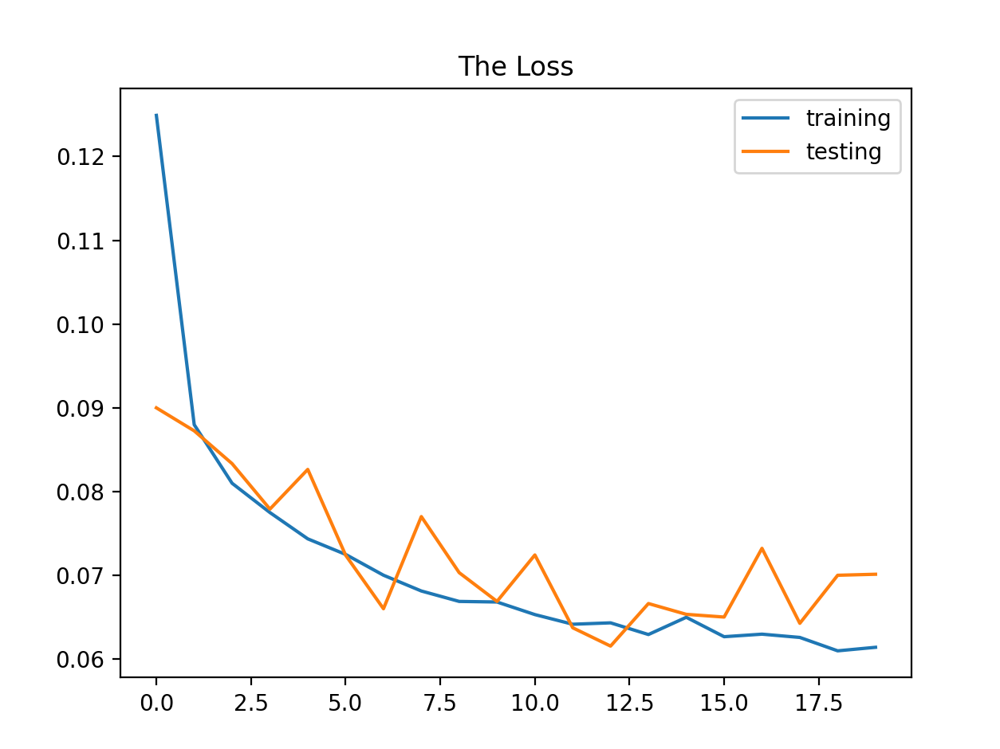

## Introduction
This project is part of the **Machine Learning for Cybersecurity course** I am taking as a cybersecurity student at the university. While I am not an ML expert, this blog outlines how to implement a deep learning model to detect malicious URLs. I will demonstrate how a neural network can classify URLs as benign or malicious using specific features. Basic ML knowledge is required, but deep expertise is not necessary.


---

## Dataset

The dataset used is the **Malicious URLs Phishing Dataset**, which contains benign and malicious URLs. The dataset and full project code are available on [GitHub](https://github.com/Feras454/Detection-of-Malicious-URLs-using-machine-learning).

---

## Step-by-Step Code Breakdown

### Step 1: Importing Necessary Libraries
```python
import pandas as pd
import numpy as np
import tensorflow as tf
from matplotlib import pyplot as plt
import re
from urllib.parse import urlparse
from keras.models import Sequential
from keras.layers import Dense
from sklearn.model_selection import train_test_split
from sklearn.preprocessing import LabelEncoder
from sklearn.metrics import accuracy_score, classification_report, confusion_matrix
```

---

### Step 2: Loading the Dataset
```python
# You can find the dataset on my github repo
data = pd.read_csv('malicious_phish.csv')
print(data.type.value_counts())
```

---


### Step 3: Feature Engineering
Custom functions extract features like the presence of an IP address, URL length, and count of sensitive words. The features and their descriptions are listed below:

| **Feature**         | **Description**                                                                        |
| ------------------- | -------------------------------------------------------------------------------------- |
| `use_of_ip`         | Whether the URL contains an IP address.                                                |
| `url_length`        | The total length of the URL.                                                           |
| `numOf-https`       | Count of 'https' occurrences in the URL.                                               |
| `numOf-http`        | Count of 'http' occurrences in the URL.                                                |
| `hostname_length`   | Length of the hostname part of the URL.                                                |
| `count-digits`      | Number of digits in the URL.                                                           |
| `count-letters`     | Number of alphabetic characters in the URL.                                            |
| `NumSensitiveWords` | Whether the URL contains sensitive words like 'PayPal,' 'login,' or 'bank.'            |
| `numOf.`            | Count of periods ('.') in the URL.                                                     |
| `numOf%`            | Count of '%' in the URL.                                                               |
| `numOf?`            | Count of '?' in the URL.                                                               |
| `numOf-`            | Count of dashes ('-') in the URL.                                                      |
| `numOf=`            | Count of equal signs ('=') in the URL.                                                 |
| `abnormal_url`      | Whether the URL contains abnormal structures.                                          |
| `binary`            | Binary representation of the URL's classification (`0` for benign, `1` for malicious). |

Each of these features was chosen because they are commonly found in malicious URLs, such as the presence of IP addresses, which are often used to evade detection, and sensitive keywords like 'login' or 'bank,' which are frequently used in phishing URLs.

---

```python
def having_ip_address(url):
    match = re.search('...', url)
    return 1 if match else 0

data['use_of_ip'] = data['url'].apply(having_ip_address)
data['url_length'] = data['url'].apply(lambda i: len(i))
data['numOf-https'] = data['url'].apply(lambda i: i.count('https'))
# Additional features are also extracted...
```

### Step 4: Label Encoding
```python
lb_make = LabelEncoder()
data['class'] = lb_make.fit_transform(data['type'])
print(data['class'].head())
```

In this project, **label encoding** is applied to the `type` column, which contains the categorical URL types (e.g., "benign", "phishing", "malware"), to convert them into numerical values that the model can process. The **LabelEncoder** from `sklearn.preprocessing` is used to transform the text labels into integers.


### Step 5: Data Splitting
```python
X = data[['use_of_ip', 'url_length', 'NumSensitiveWords', 'numOf-https']]
y = data['class']
X_train, X_test, y_train, y_test = train_test_split(X, y, test_size=0.2, stratify=y, random_state=5)
```

### Step 6: Neural Network Model
```python
model = Sequential()
model.add(Dense(128, input_shape=(X_train.shape[1],), activation='relu'))
model.add(Dense(64, activation='relu'))
model.add(Dense(4, activation='softmax'))
```

The model uses two dense layers with ReLU activation to capture non-linear patterns, and the final layer uses softmax for multi-class classification

![Head.png]

### Step 7: Compiling and Training the Model
```python
model.compile(optimizer='adam', loss='categorical_crossentropy', metrics=['categorical_accuracy'])
history = model.fit(X_train, y_train, epochs=20, validation_data=(X_test, y_test))
```

### Step 8: Model Evaluation
```python
loss, accuracy = model.evaluate(X_test, y_test, verbose=False)
print(f'Test accuracy: {accuracy:.3}')
```

The accuracy curve shows steady learning over the epochs, and the low loss indicates that the model is fitting the data well without overfitting

 


### Step 9: Visualizing Accuracy and Loss
```python
plt.plot(history.history['categorical_accuracy'], label='Training Accuracy')
plt.plot(history.history['val_categorical_accuracy'], label='Validation Accuracy')
plt.title('Model Accuracy')
plt.legend()
plt.show()
```



---

## Conclusion
This project demonstrates the application of machine learning in detecting malicious URLs. The full code and dataset can be accessed on [GitHub](https://github.com/Feras454/Detection-of-Malicious-URLs-using-machine-learning).

### References

- **Ma, J., Saul, L. K., Savage, S., and Voelker, G. M. (2009).** _Beyond Blacklists: Learning to Detect Malicious Web Sites from Suspicious URLs_. Proceedings of the 15th ACM SIGKDD Conference on Knowledge Discovery and Data Mining.
- **Verma, R. and Hossain, N. (2017).** _Phish-Zoo: Detecting Phishing Websites By Looking At Them_. IEEE Transactions on Dependable and Secure Computing.
- **Basnet, R., Mukkamala, S., and Sung, A. H. (2008).** _Detection of Phishing Attacks: A Machine Learning Approach_. Studies in Fuzziness and Soft Computing.
- **Buczak, A. L., and Guven, E. (2016).** _A Survey of Data Mining and Machine Learning Methods for Cybersecurity Intrusion Detection_. IEEE Communications Surveys & Tutorials.